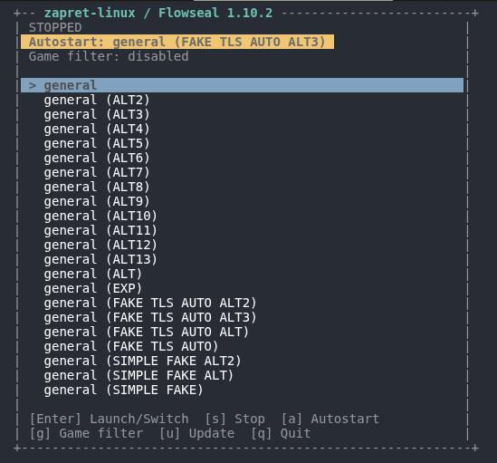
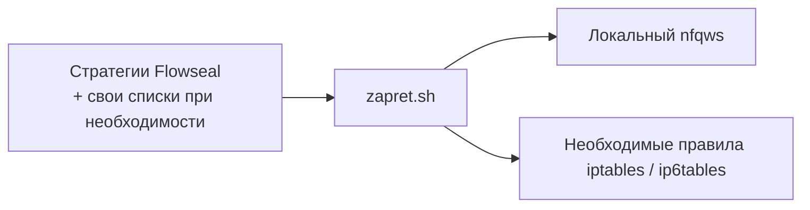

# zapret-linux-top

Самодостаточная Linux-обёртка над `nfqws` с TUI и поддержкой актуальных стратегий
[zapret-discord-youtube](https://github.com/Flowseal/zapret-discord-youtube).
Работает на поддерживаемых Linux-архитектурах без NixOS и без системного пакета zapret.

<p align="center">
  
</p>

<p align="center">
  <strong>Интерактивный launcher для выбора и запуска стратегий обхода</strong>
</p>

## Как это устроено



## Запуск

```bash
sudo ./zapret.sh
```

При первом запуске скрипт скачивает статический `nfqws` из официального релиза
[bol-van/zapret](https://github.com/bol-van/zapret) в `.local/zapret/`, а затем
скачивает, проверяет и устанавливает данные Flowseal. Локальный `nfqws` всегда
используется вместо системного пакета. Требуются root, `bash`, `curl`, `tar`,
`iptables`, `ip6tables` и поддержка NFQUEUE в ядре.

В TUI доступны:

- `Enter` — запустить или переключить стратегию;
- `s` — остановить `nfqws`;
- `a` — сохранить или отключить стратегию автозапуска;
- `g` — переключить игровой фильтр;
- `u` — безопасно обновить данные Flowseal;
- `q` — выйти.

На снимке `nfqws` остановлен; выделенную стратегию можно запустить клавишей `Enter`.

## Игровой фильтр

Режим хранится в `game-filter.conf` и применяется при следующем запуске стратегии:

- `disabled` — служебный порт `12` для TCP и UDP, как в upstream при выключенном фильтре;
- `all` — TCP и UDP `1024-65535`;
- `tcp` — TCP `1024-65535`, UDP `12`;
- `udp` — TCP `12`, UDP `1024-65535`.

Режим также можно посмотреть или изменить без TUI:

```bash
./zapret.sh game-mode
./zapret.sh game-mode tcp
```

## Пользовательские списки

При первом запуске создаётся каталог `user-lists/`:

- `list-general-user.txt` — дополнительные домены для обхода;
- `list-exclude-user.txt` — домены-исключения;
- `ipset-exclude-user.txt` — IP и подсети-исключения.

Эти файлы хранятся отдельно от скачиваемого `data/`, поэтому обновления Flowseal
их не удаляют. Перед запуском они копируются в `/tmp/zapret-run/lists` рядом с
upstream-списками.

## Проверка и обновление

```bash
./zapret.sh validate
./zapret.sh validate /path/to/flowseal-data
./zapret.sh update
```

`validate` строго проверяет каждую `general*.bat` во всех четырёх игровых режимах:

1. команда должна содержать ровно один `winws.exe`;
2. поддерживаются `%BIN%`, `%LISTS%`, `%GameFilter%`, `%GameFilterTCP%` и
   `%GameFilterUDP%`;
3. неизвестные переменные, Windows-пути и отсутствующие payload/list-файлы
   считаются ошибкой;
4. итоговая конфигурация проверяется через `nfqws --dry-run` без изменения firewall.

Обновление сначала разворачивается в staging-каталог на том же разделе. Если хотя
бы одна стратегия не проходит проверку, текущий `data/` остаётся неизменным. После
успеха набор заменяется атомарно, а предыдущий сохраняется в `data.previous/`.
Работающий обход автоматически не перезапускается.

## Автозапуск systemd

При включении автозапуска TUI сохраняет выбранную стратегию в `autostart.conf` и
создаёт обычный `/etc/systemd/system/zapret-diy.service`. Это работает на
дистрибутивах с systemd, кроме NixOS. Команды `service-start` и `service-stop`
предназначены только для этого unit.

Если раньше был импортирован сгенерированный `zapret.nix`, удалите его из
`imports` своей конфигурации NixOS и выполните rebuild: скрипт больше не создаёт
и не управляет NixOS-модулями.
